# 一、系统说明

基于springboot+vue的智能物流管理系统,系统功能齐全, 代码简洁易懂，适合小白学编程,课程设计，毕业设计。

# 二、系统架构

######      前端：vue| elementui

######      后端：springboot | mybatis 

######      环境：jdk1.8+ | mysql8.0 | maven

# 三、代码及数据库

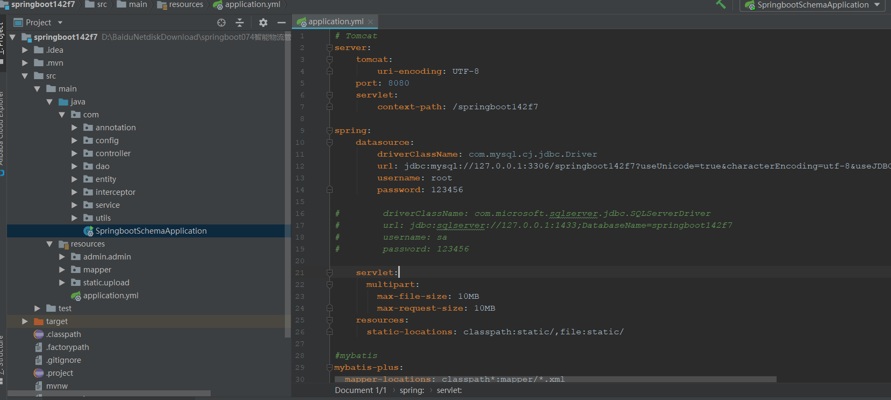

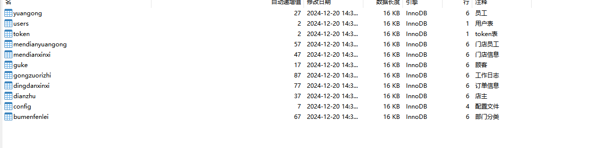

# 四、系统角色

管理员、员工、店主、顾客

5、相关功能介绍

#### 1）.管理端

###### 1.登录

###### 2.个人中心->修改密码

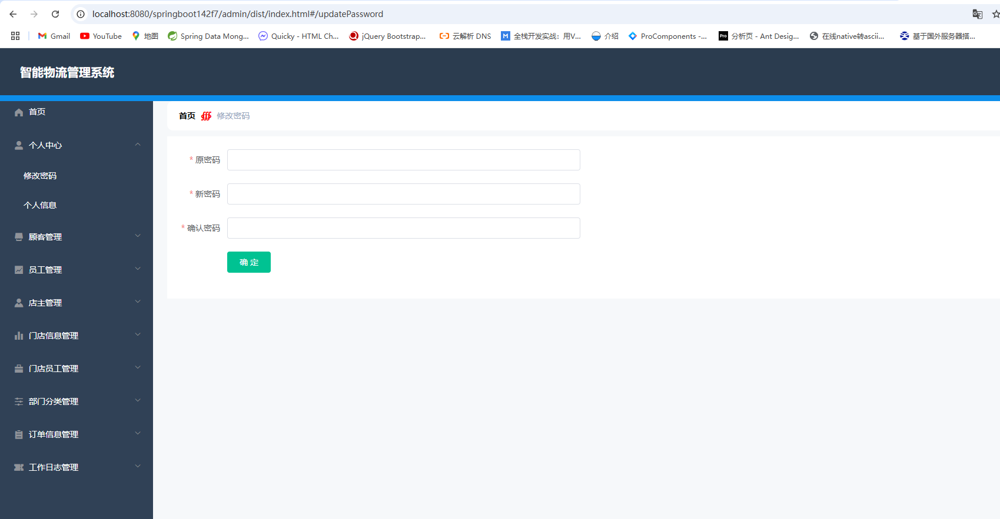

###### 3.顾客管理->顾客

包含顾客新增、删除、修改、详情

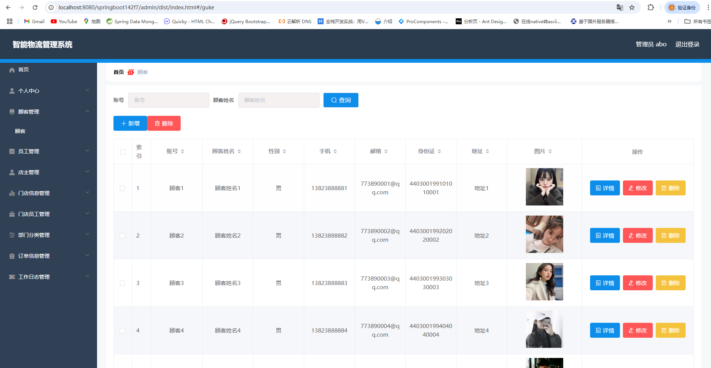

###### 4.员工管理->员工管理

包含员工新增、删除、修改、详情

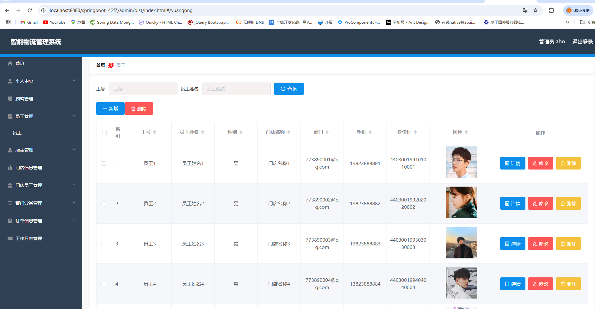

###### 5.店主管理->店主

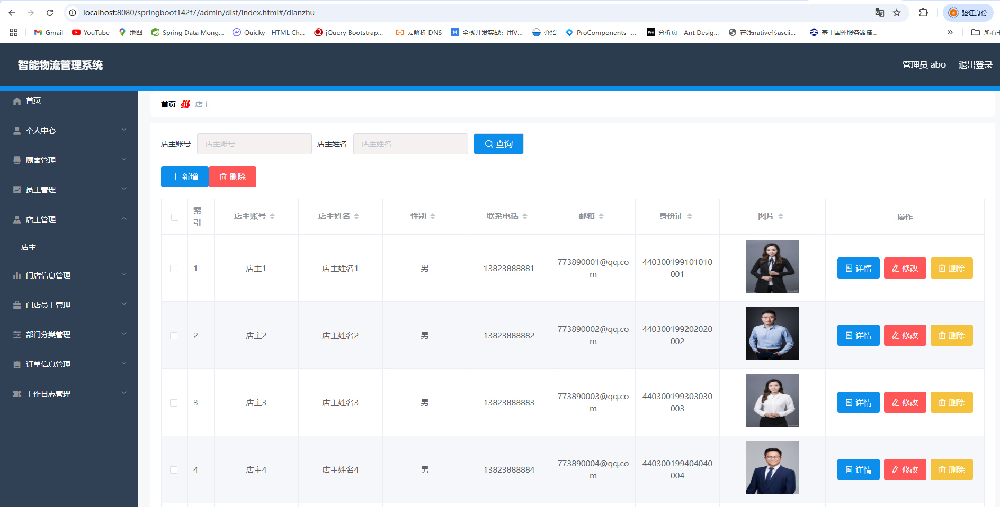

###### 6.门店信息管理->门店信息

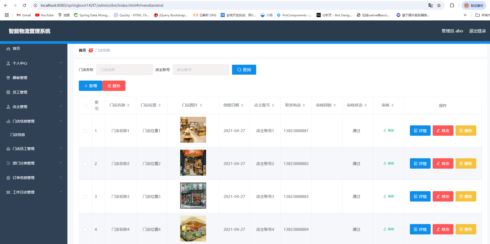

###### 7.门店员工管理->员工列表

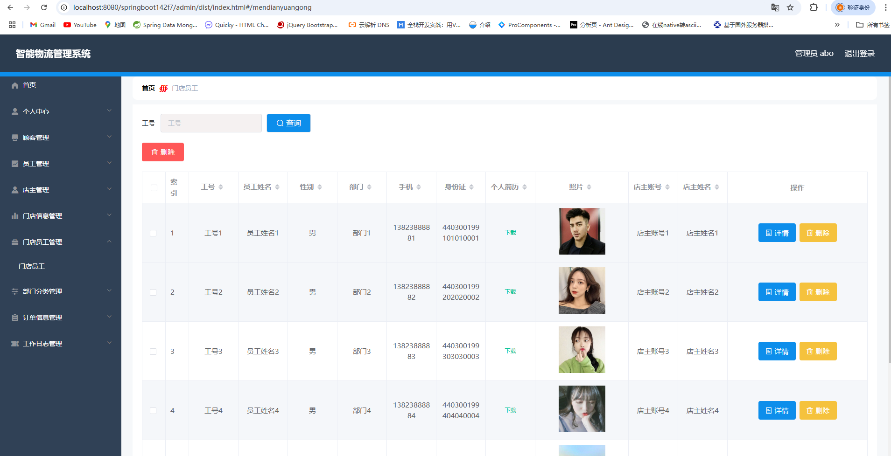

###### 8.部门分类管理->部门分类

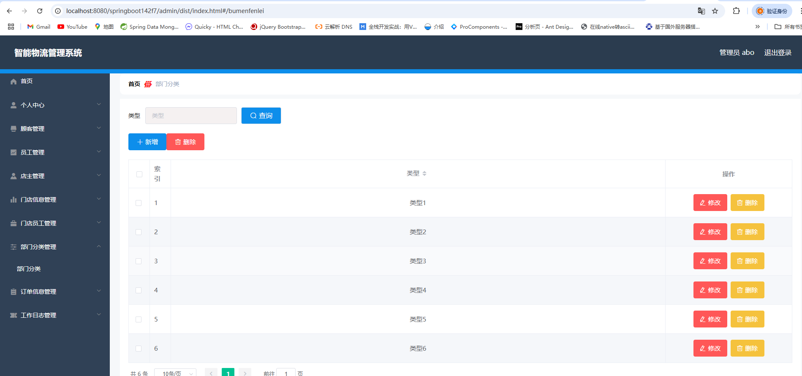

###### 9.订单信息管理->订单信息

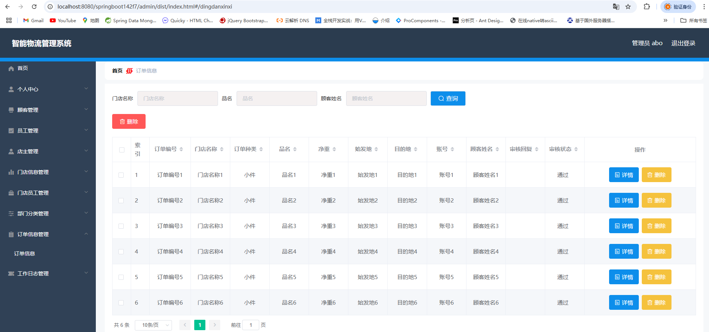

###### 10.工作日志管理->工作日志列表

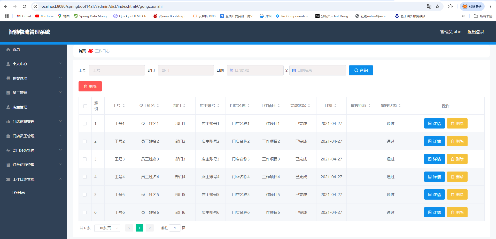

#### 2）.顾客端

###### 1.注册

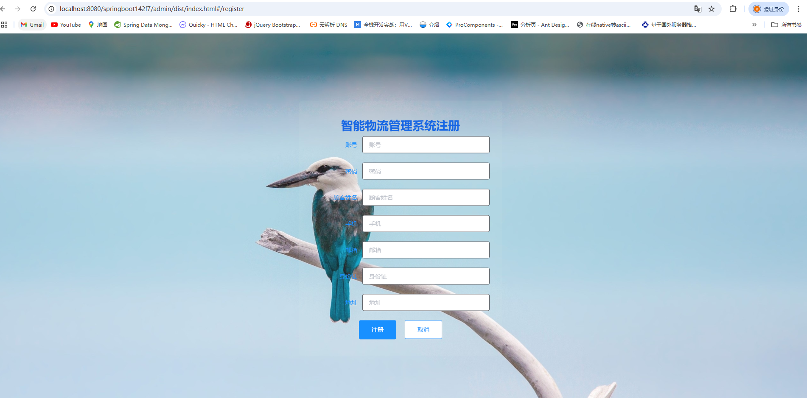

###### 2.个人中心->修改密码

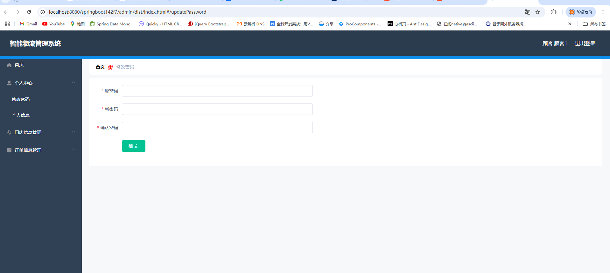

###### 3.个人中心->修改个人信息

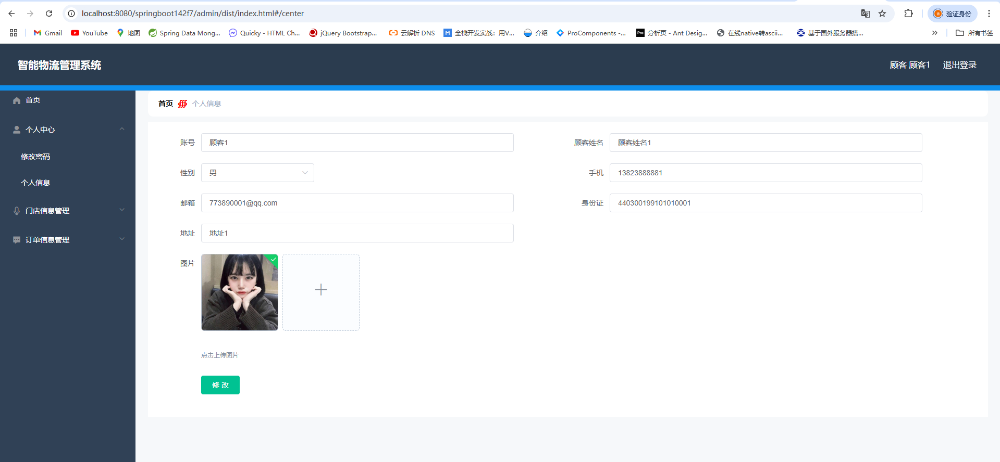

###### 4.门店信息管理->店主信息

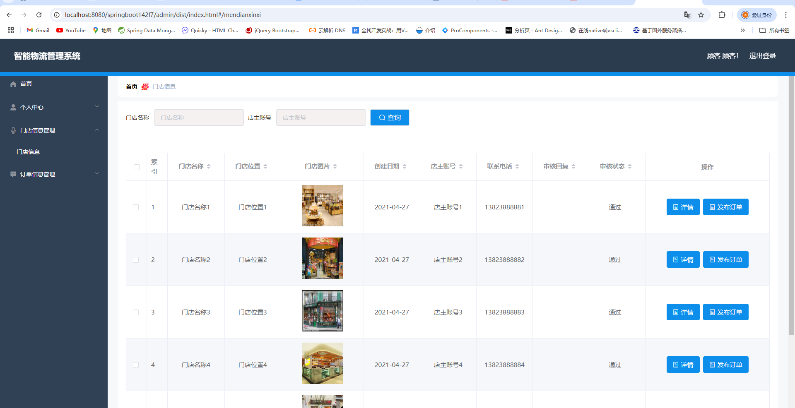

###### 5.订单信息管理->订单信息

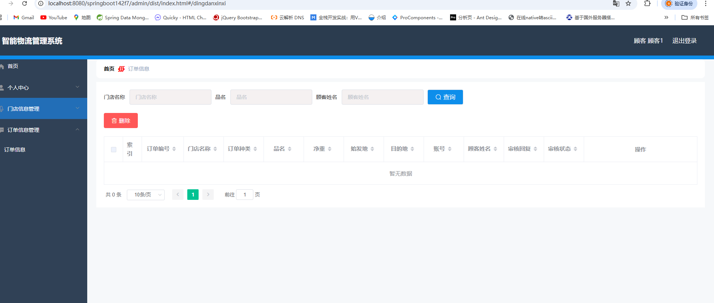

#### 3).店主

店主端功能有:员工管理、门店信息管理、门店员工管理、工作日志管理。内容与管理端一致；

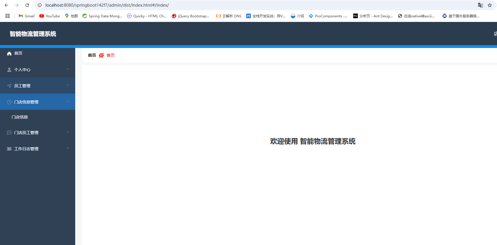

#### 4).员工端

员工端功能有:门店信息管理、订单信息管理、工作日志管理。内容与管理端一致；
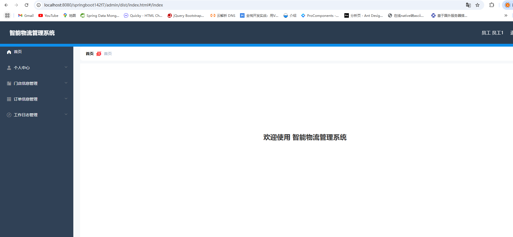
